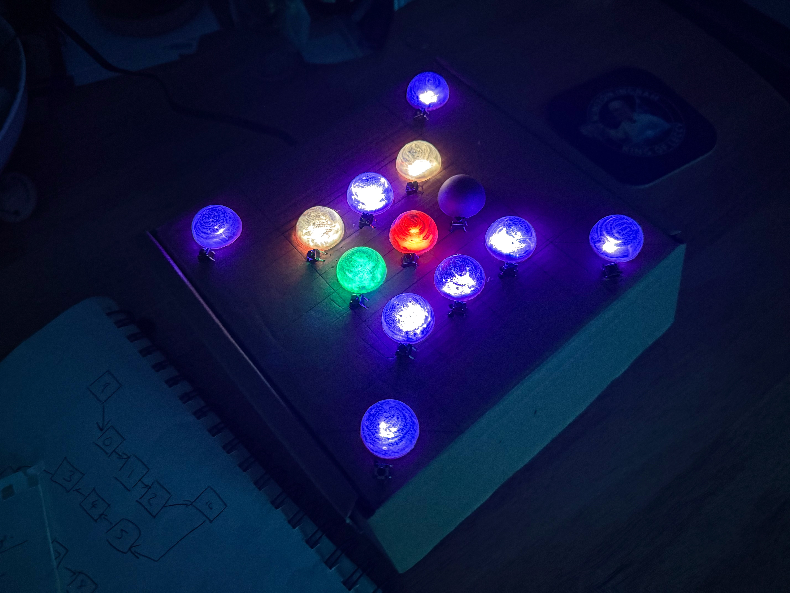
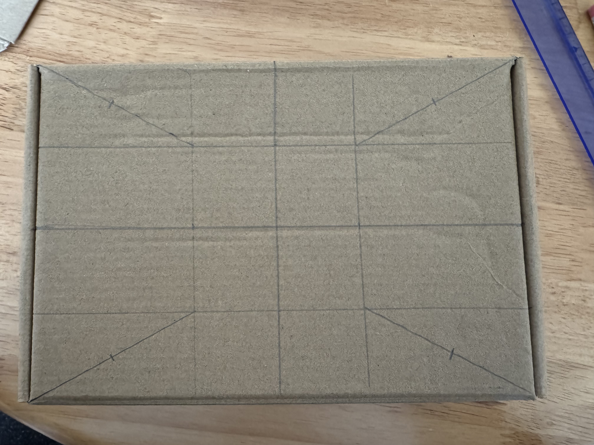
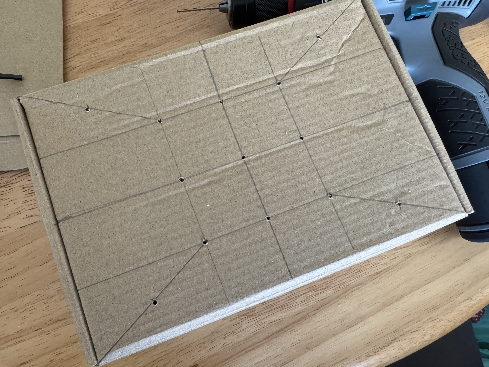
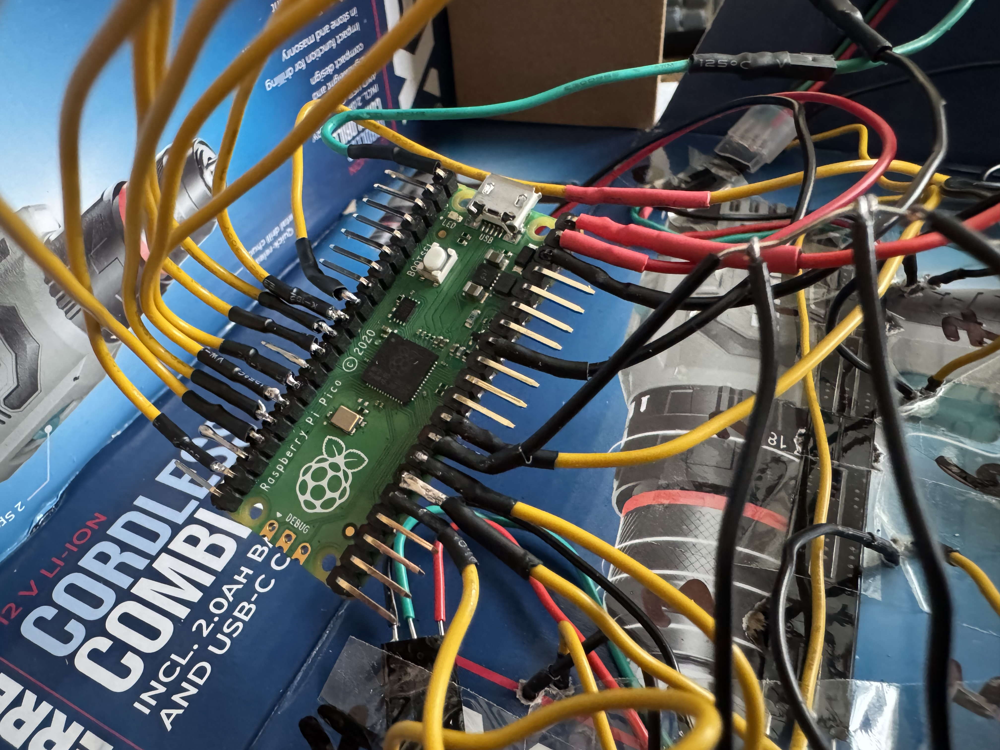

# Cardboard Mora Jai Box - Build Guide

If you've played the game *Blue Prince*, you will no doubt have come across the cute Mora Jai puzzle boxes which can be solved to reward the player or provide clues to puzzles within the game. This project will enable you to have your own (albeit simple) version of the box, filled with boxes from the game.

The code is written in MicroPython and runs on a Raspberry Pi Pico microcontroller, a low-power device which can be powered over USB from a small portable battery bank inside the box.

 The finished article!

## You Will Need

The following Python files from the GitHub repository:
* `RGB_LED_Tests.py` : A simple program to flash NeoPixel colours as an initial test.
* `main.py` : The main program which runs when the Pico is booted.
* `mora_jai_box.py` : A module containing the game logic, which can also be played in a terminal emulator.
* `game_boards.py` : A file containing many boards from the game and beyond. Spoilers abound here.

### Materials
* Cardboard Box - at least 140mm square and 50mm deep (5.5" x 5.5" x 2")
* Raspberry Pi Pico
* 13x Small tactile buttons - 5-6mm square
* WS2812 RGB LED ('NeoPixels' compatible) strip - 30 lights/metre.
* 7x Plastic ball bearings 25mm diameter, halved.
* Prototyping Wire
* USB Micro B cable
* (optional) Heat Shrink - 1mm - 1.5mm diameter
* (optional) Portable USB charger

### Tools
* Soldering Iron and Solder Flux
* Scissors and/or wire strippers
* Drill with 10mm and 2mm bits.
* Narrow tip (long nose) pliers
* Ruler and Pencil
* Black marker pen
* Sellotape and glue

**Notes**
* I like to use postal boxes with no adhesive as they can easily be turned inside out to hide any branding.
* We need 13 lights, so you could also buy them individually or cut them from a denser strip, but this will increase the amount of soldering needed.
* The ball bearings act as a diffuser for the lights. Any white/translucent plastic piece which lets light pass through will work. If you are using ping pong balls, cut them smaller so that they just cover the LED holes.
* The base Raspberry Pi Pico is enough for this project, but a new model (Pico 2) and wireless enabled model (Pico W) are available. The Pi still needs to be programmed and powered via a wire so there is no benefit to the more expensive W model.
* Arduino boards are programmed in the Arduino language which is based on C++. Some Arduino boards are MicroPython compatible and the code may run on one of these, but it is untested.

**Safety**
1. Consider eye protection - Drills can throw bits of debris around at high speed and molten solder flux is hot.
2. Work in a well ventilated space - solder can contain lead and overheating generates fumes.
3. Use solder 'helping hands' to hold components being soldered in place as they will get hot.

## Method - Building the Box
1. If you are using LEDs spaced at 30 lights/m, cut them along the solder pads into four individual lights and three strips of three. If you are using more densely spaced lights, cut 13 out individually and solder nine of them into three strips of three, spaced ~35 mm apart. Consistency is important here so take your time.
2. Make a line horizontally and vertically halfway across the top of your closed box to find the centre. This will be the middle of your main grid. Make a mark to the left and right of the centre point equal to the spacing between your LEDs, and another the same distance above and below your three existing marks.
3. From each of the corner marks, draw a line to the closest corner of your box. Make a mark halfway along each of these lines. 
4. Drill a 2mm pilot hole at each of the marks you have made, then drill a 10mm hole at each mark. Tidy the edges of each hole. 
5. Open the box and and lay the inside of the top facing you. Arrange your strips of 3 LEDs across the 3 rows of holes and place a single LED in each corner. Cut wire to the correct length and strip the ends for soldering. 
6. Paying attention to the arrows showing data in/out, solder the LEDs together. I advise starting at the top right corner (which will be top left on the outside), going right-to-left along the top row, up the other top corner, left-to-right along the middle row, down to the bottom right corner, right to left along the bottom row and finishing in the bottom left corner. In theory you can go any way here, but you will need to edit the code to match the order of your NeoPixels.
7. Secure the LEDs in place with tape. Wire the lights to the Pico, connecting +5V to the Pi's Pin 40 (VBUS), GND to any Ground Pin (I recommend the closest one to VBUS) and the Data wire to a GPIO pin. The provided scripts assume Pin 1 (GPIO 0), so change this in the script if you use a different pin. Carefully solder the wires in place.
8. Run the `LED_Blink_Test.py` script on the Pico to make sure the lights all work. Non-diffused NeoPixels are *bright* to look at.
9. Mark around each hole where the diffuser will go. Use the button legs to make holes next to each diffuser and then drill a 2mm hole through one pair of holes at each button site.
10. Measure wire to connect each button back to the Pi. One wire will go to a GPIO Pin and the other will go to GND. Each button needs its own GPIO Pin but they can share a ground. I stripped the coating off one long length of wire, soldered it to a Pico GND Pin and then twisted all the other ground wires to it. Thread some heat shrink (if using) to protect and strengthen the wiring at the buttons. The one large ground wire can be seen here.
11. Solder the wires to the buttons and the Pi GPIO Pins. Make note of which pin each button is connected to in order to update the `main.py`program.  
12. Update the Pin map in the `main.py` program and save it, `mora_jai_box.py` and `game_boxes.py` to the Pico.
13. Colour one side of your LED Diffusers with the black marker and glue them over each LED. Your box is now complete!

The Pi Pico with all wires soldered. Yellow is button input, black is ground, green is NeoPixel data and red is +5V.

Pinout for the Pi Pico. Make sure you only connect button inputs to the green GPIO pins and note down which ones you used.

## How to load data to a Raspberry Pi Pico
* I use the free program [Thonny](https://thonny.org) to save software to the Pico. It runs on Windows, Mac and Linux and comes built into Raspberry Pi OS if you have a 'full size' Pi.
* With the Pico plugged into the computer via USB, open Thonny and make sure the interpreter (in the bottom right corner) is running on the Pico and not the local interpreter. You might need to click 'Install MicroPython' and work through the steps to flash the correct version to your Pico.
* Open the python file you want to move to the Pico in Thonny and use File > Save As... (or Ctrl/Cmd + Shift + S) to save it to the Pico. In the file name tab above the editor window, files stored on the Pico are surrounded in \[ Square Brackets \].
* If you get a 'backend not ready' message, there is still a program running on the Pi. Click the 'Stop' button to interrupt it.
* Run the software by clicking the green Play button on the toolbar.
* The Pico will run any program called `main.py` automatically when connected to power, but Thonny can run any script while the Pico is connected via USB.

## Playing the Box
When the box is powered on, the lights will cycle through all colours before selecting a random box. Play by clicking the button next to each tile like you would in *Blue Prince*. Once a corner matches its target colour, pressing the corner button will light up that corner. Light up all four corners to win!
**Reset a game** by pressing any non-matching corner.
**Get a new random board** by pressing any non-matching corner five times when on a starting board.
Winning will light up all LEDs blue, before a new random box is selected.

**Adjust Difficulty**: There is no auto-game generator, all start configurations are pre-loaded from the game or Chandler Griscom’s website (see acknowledgements). To remove harder boxes from play, comment out parts of the `from game_boxes import house (etc)` and `boxes =` line below, which is arranged roughly in order of increasing difficulty.

## Acknowledgements
Firstly to Tonda Ros and the entire team behind *Blue Prince*, thank you for making such a beautiful game filled with so much lore to uncover, as well as the deceptively tricky puzzle boxes. I am also indebted to the rest of the maker community who have also fallen in love with these puzzles, in particular to Chandler Griscom whose [online MJ Box Simulator](https://chandler.io/posts/2025/07/mora-jai-box-simulator/) was an invaluable tool for testing, pulling the puzzles from the game and finding more challenging boxes to play. Also to Unnecessary Automation, who 3D printed a stunning and realistic box and [documented the process](https://youtu.be/jrtt_Or5D1g) on YouTube and was an inspiration to embark on this rougher draft.
